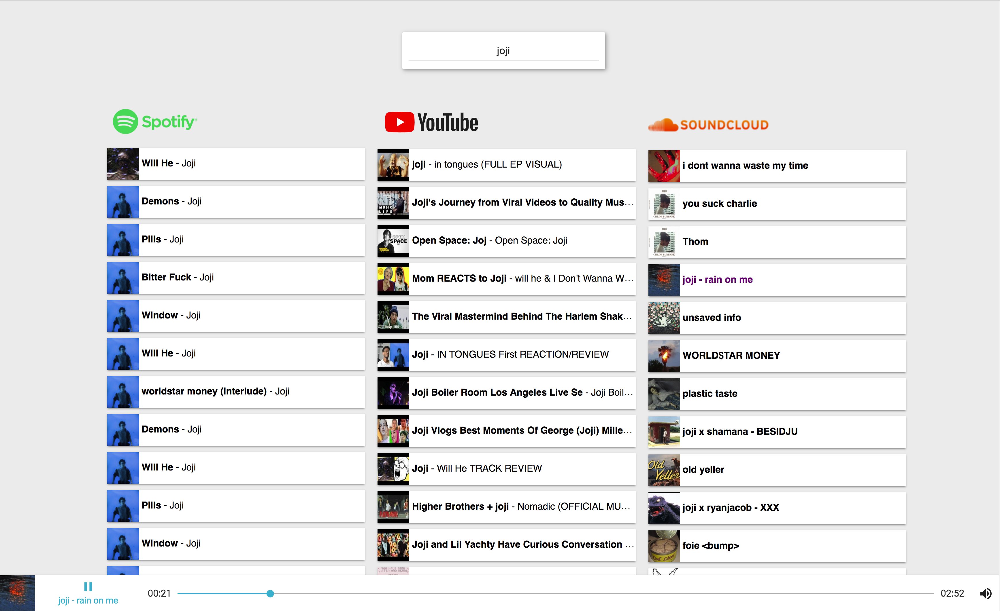

# Project Streamaster
A minimalistic music streaming platform that aggregates search results from Spotify,Soundcloud and YouTube, built with ReactJS. It features a built in player so you can play songs right from the app.

## You must have a Spotify Premium Account to use the service


## Getting Started

If you want to try it out, go to https://streamaster.herokuapp.com

If you wish to run it on your machine, follow the steps bellow
### Prerequisites

Make sure you have node and npm installed and updated then run the following
Or just s
```
cd Project-Streamaster/streamaster-front
npm install
npm start
```

### Screenshot

## Contributing

Since there are still a few bugs and a lot of room for new features, feel free to submit a pull request :)


## Authors
* **Frederico Curti** - [GitHub](https://github.com/fredericocurti)
* **Sabrina Simão** - [GitHub](https://github.com/SabrinaSimao)
* **Bruna Kimura** - [GitHub](https://github.com/BrunaKimura)
